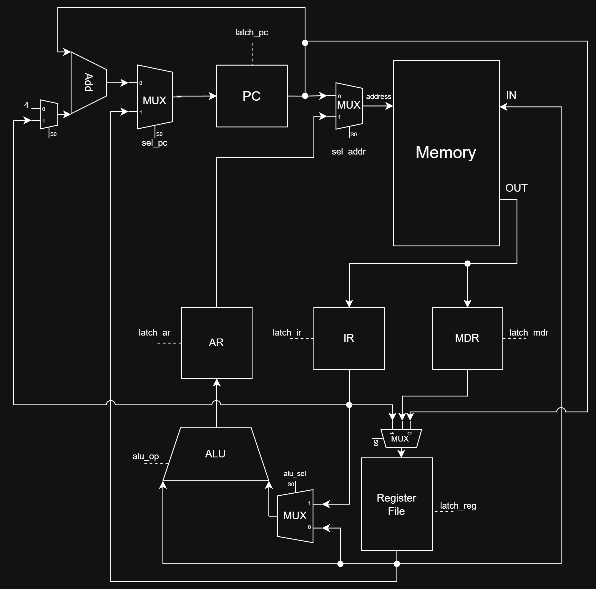
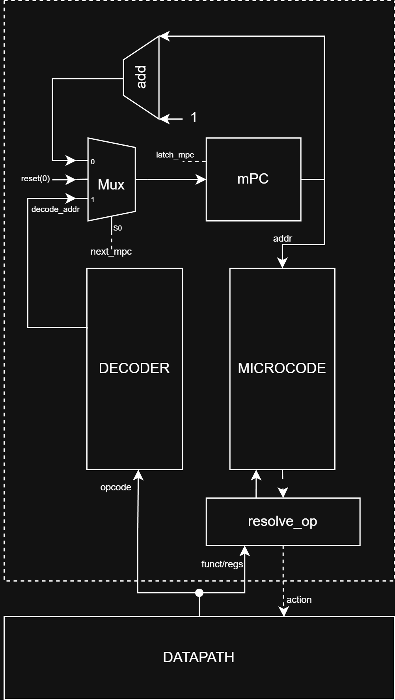

# MyRISC32. Транслятор и модель

- Студент: _Рыжаков Владислав Александрович Р3223_
- Вариант: `asm | risc | neum | mc | tick | binary | stream | mem | cstr | prob1 | vector`

Реализация условного RISC-процессора и транслятора ассемблера к нему. Усложнение `vector` не делалось.

**Содержание**

- [Язык программирования](#язык-программирования)
- [Организация памяти](#организация-памяти)
- [Система команд](#система-команд)
- [Транслятор](#транслятор)
- [Модель процессора](#модель-процессора)
- [Тестирование](#тестирование)
- [Запуск](#запуск)

---

## Язык программирования

Синтаксис в расширенной БНФ:

```
program ::= { line }

line ::= [label] [instr] [comment] "\n"
       | directive [comment] "\n"
       | [comment] "\n"

label    ::= name ":"
name     ::= letter { letter | digit | "_" }

instr    ::= mnemonic { operand }
operand  ::= register | integer | label | "(" register ")" | imm "(" register ")"

directive ::= ".data"
            | ".text"
            | ".org" integer
            | ".word" (integer | label)
            | ".cstr" string

register ::= "zero" | "ra" | "sp" | "t0" | "t1" | "a0" | "a1" | "a2"
           | "r0" | "r1" | "r2" | "r3" | "r4" | "r5" | "r6" | "r7"

integer  ::= [ "-" ] digit { digit }
           | "0x" { hex_digit }-

string   ::= "\"" { any_char } "\""

comment  ::= ";" { any_char_except_newline }
```

Особенности:

- Комментарии однострочные, начинаются с `;`.
- Регистр имён инструкций не важен (всё приводится к нижнему регистру).
- Метки определяются на отдельной строке либо перед инструкцией: `loop: addi t0, t0, 1`.
- Дубликаты меток запрещены, транслятор бросит ошибку.
- Псевдоинструкции: `nop`, `li rd, imm`, `la rd, label` — раскрываются в реальные инструкции (см. ниже).
- Строки `.cstr` поддерживают escape-последовательности: `\n`, `\t`, `\\`, `\"`.
- Каждый символ строки `.cstr` занимает одно машинное слово (4 байта) — это требование варианта `cstr`.
- Литералы чисел: десятичные (`42`, `-1`), шестнадцатеричные (`0x80`).

Пример программы (`hello.asm`):

```
.data
.org 0x100
msg:       .cstr "Hello, World!\n"
out_addr:  .word 0x84

.text
_start:
    la   t1, out_addr
    lw   t1, 0(t1)
    la   t0, msg
loop:
    lw   a0, 0(t0)
    beqz a0, done
    sw   a0, 0(t1)
    addi t0, t0, 4
    j    loop
done:
    halt
```

## Организация памяти

Память — единое адресное пространство (фон Нейман): код и данные лежат вместе. Адресация байтовая, машинное слово — 32 бита. Порядок байт - big-endian.

```
+-------------------+ 0x0000
|   секция данных   |   (строки .cstr, .word)
|                   |
+-------------------+ 0x0080  ← порт ввода  (lw читает символ из stdin)
+-------------------+ 0x0084  ← порт вывода (sw пишет символ в stdout)
+-------------------+
|   ...             |
+-------------------+ 0x0100  ← обычно сюда ставится .org для секции .text
|   секция кода     |
|                   |
+-------------------+
|   ...             |
+-------------------+ 0x0800  ← стек (растёт вниз)
+-------------------+ 0x1000  ← конец памяти (по умолчанию)
```

Ввод-вывод (вариант `mem` + `stream`):

- Чтение/запись осуществляется обычными `lw`/`sw` по специальным адресам.
- Адрес `0x80` — порт ввода. `lw rd, 0(rs1)` при `rs1 = 0x80` извлекает следующий символ из входного буфера. Если буфер пуст — симуляция останавливается.
- Адрес `0x84` — порт вывода. `sw rd, 0(rs1)` при `rs1 = 0x84` добавляет младший байт `rd` в выходной буфер.
- Входной буфер формируется один раз при старте из файла, выходной собирается в строку по завершении.

Регистровый файл:

|Имя|Номер|Назначение|
|---|---|---|
|zero|r0|Константа 0. Запись игнорируется|
|ra|r1|Адрес возврата из процедуры|
|sp|r2|Указатель стека|
|t0|r3|Временный|
|t1|r4|Временный|
|a0|r5|Аргумент / результат функции|
|a1|r6|Аргумент|
|a2|r7|Аргумент|

Соглашение о вызовах:

- Аргументы передаются в `a0`, `a1`, `a2`. Результат возвращается в `a0`.
- Если функция вызывает другую функцию (есть `jal`), она обязана сохранить `ra` на стеке перед вызовом и восстановить перед своим `jr ra`.
- Регистры `t0`, `t1`, `a1`, `a2` считаются временными — могут быть затёрты вызовом.

## Система команд

Особенности процессора:

- 8 регистров общего назначения, `r0` всегда равен 0.
- Все инструкции имеют фиксированную длину 4 байта.
- Арифметика только регистр-регистр или регистр-константа; обращение к памяти отдельными инструкциями `lw`/`sw`.
- Поток управления: счётчик команд `PC` инкрементируется на 4 после fetch; условные/безусловные переходы относительные.

### Форматы инструкций

Используются 4 формата.

**R-type** (регистр-регистр):

```
 31      25 24  22 21  19 18  16 15               0
+----------+------+------+------+------------------+
|  opcode  |  rd  | rs1  | rs2  |       funct      |
|  7 бит   | 3 б. | 3 б. | 3 б. |       16 бит     |
+----------+------+------+------+------------------+
```

**I-type** (с непосредственным значением):

```
 31      25 24  22 21  19 18                     0
+----------+------+------+------------------------+
|  opcode  |  rd  | rs1  |          imm           |
|  7 бит   | 3 б. | 3 б. |         19 бит         |
+----------+------+------+------------------------+
```

`imm` знаково расширяется до 32 бит. Для `sw` поле `rd` содержит регистр-источник данных.

**U-type** (только для `lui`):

```
 31      25 24  22 21                            0
+----------+------+------------------------------+
|  opcode  |  rd  |             imm              |
|  7 бит   | 3 б. |             22 бит           |
+----------+------+------------------------------+
```

Отдельный формат нужен, чтобы поле `imm` уместило 20-битную часть адреса для `lui`, которая вместе с `addi` (12 бит) даёт полный 32-битный адрес.

**J-type** (только для `j`):

```
 31      25 24                                   0
+----------+---------------------------------------+
|  opcode  |             addr                      |
|  7 бит   |             25 бит                    |
+----------+---------------------------------------+
```

### Набор инструкций

|Мнемоника|Тип|opcode|Тактов|Описание|
|---|---|---|---|---|
|`add rd, rs1, rs2`|R|0x01|2|rd = rs1 + rs2|
|`sub rd, rs1, rs2`|R|0x01|2|rd = rs1 - rs2|
|`mul rd, rs1, rs2`|R|0x01|2|rd = rs1 * rs2|
|`div rd, rs1, rs2`|R|0x01|2|rd = rs1 / rs2 (целочисл.)|
|`rem rd, rs1, rs2`|R|0x01|2|rd = rs1 % rs2|
|`and/or/xor`|R|0x01|2|побитовые|
|`sll/srl rd, rs1, rs2`|R|0x01|2|сдвиги|
|`addi rd, rs1, imm`|I|0x02|2|rd = rs1 + imm|
|`andi/ori/xori`|I|0x03-5|2|побитовые с константой|
|`slli/srli`|I|0x06-7|2|сдвиги на константу|
|`slti rd, rs1, imm`|I|0x08|2|rd = (rs1 < imm) ? 1 : 0|
|`lui rd, imm`|U|0x09|2|rd = (imm & 0xFFFFF) << 12|
|`lw rd, imm(rs1)`|I|0x0A|3|rd = MEM[rs1 + imm]|
|`sw rd, imm(rs1)`|I|0x0B|3|MEM[rs1 + imm] = rd|
|`beqz rs1, label`|I|0x0C|2|если rs1 == 0: PC += offset|
|`bnez rs1, label`|I|0x0D|2|если rs1 != 0: PC += offset|
|`beq rs1, rs2, label`|R|0x0E|2|rs1 == rs2 — переход|
|`bne rs1, rs2, label`|R|0x0F|2|rs1 != rs2 — переход|
|`bgt rs1, rs2, label`|R|0x10|2|rs1 > rs2 — переход|
|`ble rs1, rs2, label`|R|0x11|2|rs1 <= rs2 — переход|
|`j label`|J|0x12|2|PC = PC + addr*4|
|`jal label`|I|0x13|2|ra = PC+4; PC = PC + imm*4|
|`jr rs1`|I|0x14|2|PC = rs1|
|`mv rd, rs1`|I|0x15|2|rd = rs1|
|`halt`|—|0x00|1|остановить симуляцию|

R-type арифметические различаются полем `funct`:

|Мнемоника|funct|
|---|---|
|add|0x00|
|sub|0x01|
|mul|0x02|
|div|0x03|
|rem|0x04|
|and|0x05|
|or|0x06|
|xor|0x07|
|sll|0x08|
|srl|0x09|

### Псевдоинструкции

|Запись|Раскрытие|
|---|---|
|`nop`|`addi zero, zero, 0`|
|`li rd, imm`|`lui rd, imm>>12` + `addi rd, rd, imm&0xFFF`|
|`la rd, label`|`lui rd, %hi(label)` + `addi rd, rd, %lo(label)`|

### Бинарное представление

Бинарный файл состоит из:

1. **Заголовка** — 4 байта, big-endian, адрес метки `_start` (точка входа). Симулятор устанавливает в этот адрес `PC` при старте.
2. **Сам код и данные** — последовательность 32-битных слов в том порядке, в котором они расположены в исходнике с учётом `.org`.

Помимо бинарника транслятор генерирует отладочный дамп — текстовый файл `*.debug` с тремя колонками:

```
ADDR  WORD       MNEMONIC
0100  12C00000   la→lui t0, 0x0
0104  04D80000   la→addi t0, 0x0
0108  15580000   lw a0 0 t0
...
```

## Транслятор

CLI: `python translator.py <input.asm> <output.bin>`

Реализован в файле `translator.py`. Этапы:

1. **Очистка** (`clean_lines`) — удаление комментариев и пустых строк.
2. **Первый проход** (`first_pass`) — обход всех строк, сбор таблицы символов `{имя_метки: адрес}`. Для каждой инструкции/директивы вычисляется её размер и обновляется `pc`.
3. **Второй проход** (`second_pass`) — повторный обход с генерацией машинных слов. Метки в момент кодирования уже известны, поэтому переходы вычисляются как `(target - pc) // 4`.

Псевдоинструкции `li` и `la` раскрываются на этапе генерации в две настоящие инструкции `lui` + `addi`.

Поддерживаются:

- директивы: `.data`, `.text`, `.org`, `.word`, `.cstr`;
- метки на отдельной строке либо вместе с инструкцией;
- escape-последовательности в строках;
- модификаторы `%hi(label)`, `%lo(label)` для получения старшей и младшей частей адреса.

Транслятор бросает ошибку при:

- неизвестной инструкции или регистре;
- дубликате метки;
- `.org` с адресом меньше текущего `pc`;
- отсутствии метки `_start` в программе.

## Модель процессора

CLI: `python machine.py <program.bin> [input.txt]`

Реализована в файле `machine.py`. Состоит из классов `Memory`, `RegisterFile`, `ALU`, `DataPath`, `ControlUnit` и функции-цикла `simulate`.

### DataPath


Внутренние регистры:

- `PC` — счётчик команд.
- `IR` — текущая инструкция (32 бита).
- `AR` — адрес для обращения в память (`lw`/`sw`).
- `MDR` — данные, прочитанные из памяти.

Memory является единой (`neum`) — код и данные в одном массиве. Чтение/запись по адресам `0x80` и `0x84` перехватываются и направляются в потоки ввода/вывода (`stream` + `mem`).

ALU реализован отдельным классом. Поддерживает арифметику и логику; деление на 0 возвращает -1. Результат обрезается до знакового 32-бит.

DataPath предоставляет «сигналы» — методы `signal_*`, каждый соответствует одному такту:

- `signal_fetch` — `IR = MEM[PC]; PC += 4`
- `signal_calc_addr` — `AR = rs1 + imm`
- `signal_mem_read` — `MDR = MEM[AR]`
- `signal_mem_write` — `MEM[AR] = rd`
- `signal_writeback` — `rd = MDR`
- `signal_alu_r(op)` — `rd = ALU(rs1, rs2)`
- `signal_alu_i(op)` — `rd = ALU(rs1, imm)`
- `signal_lui` — `rd = (imm & 0xFFFFF) << 12`
- `signal_branch_i(taken)` / `signal_branch_r(taken)` — условные переходы
- `signal_jump` / `signal_jal` / `signal_jr` — безусловные переходы
- `signal_mv` — `rd = rs1`

DataPath «глупый»: он не знает в каком порядке вызывать сигналы — это решает `ControlUnit`.

### ControlUnit

Микрокодированный (вариант `mc`).



Структура:

- `mPC` — счётчик микрокоманд.
- `MICROCODE` — словарь `{адрес: MicroInstruction}`. Микроинструкция содержит имя сигнала, который надо вызвать в DataPath, и правило перехода к следующему `mPC`: `+1`, `decode`, `reset`.
- `DECODER` — таблица `{opcode: адрес_блока}`. После `fetch` `mPC` прыгает на адрес блока микрокода для текущей инструкции (непрямое отображение).

Раскладка адресов микрокода:

| `mPC` | Что делает                                |
| ----- | ----------------------------------------- |
| 0     | FETCH (общий первый такт всех инструкций) |
| 10    | блок R-type арифметики                    |
| 11    | блок I-type арифметики                    |
| 12    | блок `lui`                                |
| 20–22 | блок `lw` (3 такта: ADDR, READ, WB)       |
| 30–31 | блок `sw` (2 такта: ADDR, WRITE)          |
| 40    | блок `mv`                                 |
| 50    | блок ветвлений I-type                     |
| 51    | блок ветвлений R-type                     |
| 60    | блок `j`                                  |
| 61    | блок `jal`                                |
| 62    | блок `jr`                                 |
| 70    | блок `halt`                               |

R-type арифметика и I-type арифметика делят общий блок микрокода, конкретная ALU-операция выбирается в момент исполнения по полям `funct`/`opcode` (метод `resolve_alu_op`). Аналогично для ветвлений (`resolve_branch_taken`).

Каждый такт:

1. Считывается микроинструкция по адресу `mPC`.
2. Вызывается соответствующий метод `signal_*` в DataPath (или поднимается флаг остановки для `halt`).
3. `mPC` обновляется: `+1` / прыжок через декодер / сброс в 0 (новый fetch).
4. Счётчик тактов увеличивается, состояние пишется в журнал.

Остановка симуляции:

- инструкция `halt`;
- исключение `StopIteration` (пустой входной буфер при чтении из порта `0x80`);
- превышение лимита тактов (защита от зацикливания).

## Тестирование

Используются юнит-тесты транслятора и golden-тесты программ. Реализовано в `tests/`, запускаются через `pytest`.

1. `tests/test_translator.py` — проверка корректности кодирования отдельных инструкций (R/I/U/J форматы, знаковое расширение).
2. `tests/test_programs.py` — интеграционные тесты: транслируем `.asm`, прогоняем через симулятор, сверяем вывод.

Тестируемые программы:

|Программа|Что проверяет|
|---|---|
|`hello.asm`|вывод C-строки, цикл по `.cstr`|
|`cat.asm`|посимвольное чтение из stdin и вывод в stdout|
|`hello_user_name.asm`|приглашение, чтение в буфер, конкатенация строк|
|`euler4.asm`|главный алгоритм варианта (`prob1` = Euler Problem 4)|

Программа `euler4.asm` находит наибольший палиндром-произведение двух трёхзначных чисел. Ответ: **906609 = 913 × 993**. Использует подпрограммы `is_palindrome` и `print_int`, вызовы через `jal`/`jr ra`, сохранение регистров на стеке.

CI настроен через GitHub Actions: при каждом пуше запускается `ruff` (линтер), `mypy` (проверка типов), `pytest` (тесты).

## Запуск

Требования: Python 3.11+, `pytest`.

```
# Установка зависимостей для тестов и линтеров
pip install pytest ruff mypy

# Транслировать программу
python translator.py programs/hello.asm programs/hello.bin

# Запустить программу на симуляторе (с файлом ввода)
python machine.py programs/hello.bin

# Запустить с входными данными
python machine.py programs/cat.bin programs/input.txt

# Запустить все тесты
pytest tests/ -v

# Линтер и проверка типов
ruff check .
mypy translator.py machine.py isa.py
```

Пример работы:

```
$ python translator.py programs/hello.asm programs/hello.bin
Готово: 56 байт → programs/hello.bin
Дамп:   programs/hello.debug

$ python machine.py programs/hello.bin
======================================================================
ВЫВОД ПРОГРАММЫ:
======================================================================
'Hello, World!\n'

Как текст:
Hello, World!
```